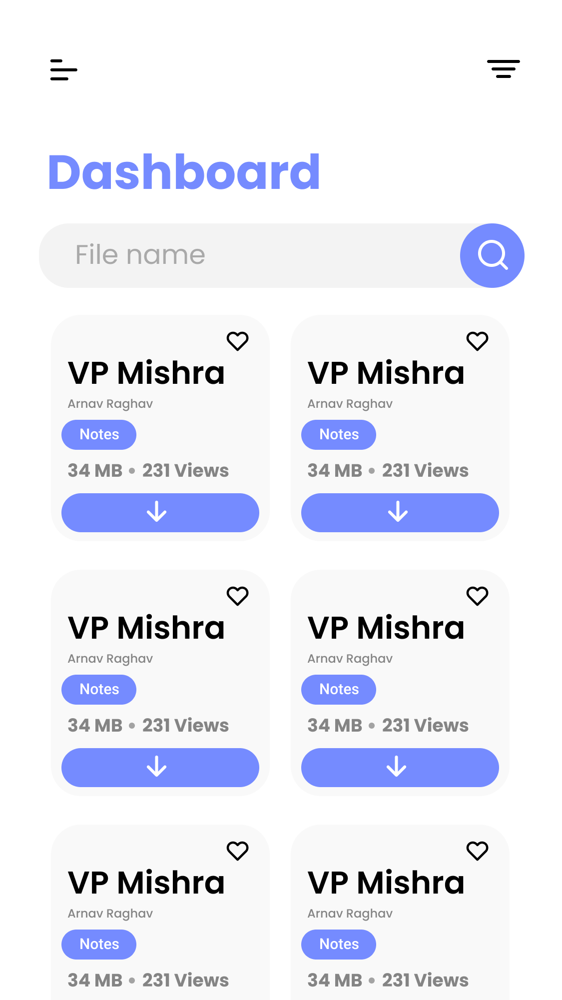

       

# AkashScrapper

Noteshub is an notes providing application where you can upload and download the notes. Noteshub is specific to IPU University. AkashScrapper is an application built with Noteshub API. It is much more modular in terms of features and code. This solves some problems which user faces while using Noteshub. You can also call it as <b>Noteshub - Remastered</b>

## What problems does this application solves which noteshub was not able to:

 - It provides material design for the user making great UI/UX.
 
 - Students can download notes within the app and can see through the app only. Providing <b>Encryption</b> to the notes/practical files downloaded by the user.
 
 - Can star their important pages in the pdf and can see them to revise quickly.
 
 - Can view semester subjects at a time. As previously NotesHub provides us only one semester subjects at a time.
 
 - User can mark as favourite, downloaded pdf's and recently viewed in a seperate section. Helping user to find the pdf easily rather than scrolling though whole list again and again

# State: Developing

# Design Decisions & Dependencies:
## Kotlin:
I ❤️ Kotlin. It's a breath of fresh air when coming from Java, and makes code so much nicer to read and write. It has OOTB support for Lambdas, Extension Functions, DSLs and a vast stdlib. JetBrains actively maintains and releases stable versions every month. All my projects (including this one) will be 100% Kotlin.

## JetPack - Architecture Components & AndroidX:
Would be a loss to build an application without these libraries. With Google advocating MVVM, and these libraries working so flawlessly with each other, it really leaves you no choice.
Room - Database Layer

<b>ViewModel</b> - Data Preservation across configuration changes

<b>Lifecycle</b> - Handling annoying issues with Activities / Fragments namely when pushing data during false states

<b>Navigation</b> - Handling Intent / Fragment Transactions, isolating sources from destinations and easy argument passing!

<b>AndroidX, Material Components</b> - For embracing Material Design and backporting API features to minSdk

<b>Paging 3</b> - sets up a Repository that will use the local database to page in data for the UI and also back-fill the database from the network as the user reaches to the end of the data in the database.

## Koin - Dependency Injection:
Sick and tired of Dagger in Production, and annoyed by it slowing down my build, I turned to a substitute. Koin seemed to be the recommended (and a more established) library for Android, however I chose Koin for it's sheer simplicity. It also made strides in performance in v2.0, which makes it my current choice for DI without code generation.
also made strides in performance , which makes it my current choice for DI without code generation.

## Gson + Retrofit - Networking:
A very simple choice when it comes to using REST APIs.

## Multi Modular

Separation of Concerns and eventually supporting Instant Apps and Dynamic Delivery.
Modules are split by feature, with some base modules like core and data. Multi-modular applications force you to isolate components and prevent easy imports / dependencies between them.
Such applications can build faster too, since Gradle caches the unchanged modules, and will only build the changed ones (and the modules dependent on the changed module if a public API is touched)
